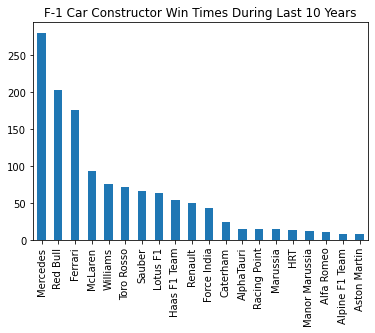

# Topic: Racing Strategies of Formula One

## Background
Formula 1 (a.k.a. F1 or Formula One) is one of the most popular car racing competitions, receiving lots of attention and participation from worldwide car manufacturers and players. Being the highest class of single-seater auto racing, F1 is sanctioned by the Fédération Internationale 
de l'Automobile (FIA) and is owned by the Formula One Group. 
One of the fascinating components in F1 is the pit stop in which the players stop the car to perform maintenance such as tire replacement and fuel refilling within seconds. Thus, how to wisely utilize pit stops has become one popular topic in F1. And the authors of the previous project and we decided to focus on the strategies of F1 like pit stops distribution and eventually the effect on the ranking.

## Glossary
- Pit stop
  - In motorsports, a pit stop is a pause for refuelling, new tyres, repairs, mechanical adjustments, a driver change, as a penalty, or any combination of the above. These stops occur in an area called the pits, most commonly accessed via a pit lane which runs parallel to the start/finish straightaway of the track and is connected to it at each end.
- Pit
  - (verb) To pause in the pit lane to do the pit stop things.
- Pit-Stopping Strategy
  - All drivers will pit at least once in each race. 
  - Each driver has their own strategy in
    - choosing the total number of pit stops in each race
    - choosing when to pit 
- Lap time
  - The time recorded for a driver to run one entire lap

## Contents
1. Original Work Review
   1. Introduction
   2. Critique
   3. Improvement Description 
2. Data Analytics of Racing Strategies of Formula One
   1. Pit Stop Strategy
      1. Hypothesis: Fewer pit stops give the driver a better rank in each race 
      2. Hypothesis: The pit stops are evenly distributed 
      3. Hypothesis: Evenly distributed pit stops give better race results
   2. Racing Speed Strategy
      1. Hypothesis: 
   3. Exploratory Analysis on Car Constructors and Groups
   4. Results Summary

## 1. Original Work Review
### 1.1 Original Work Introduction
#### 1.1.1 Original Dataset
Data Source: https://www.kaggle.com/datasets/rohanrao/formula-1-world-championship-1950-2020

The dataset includes 14 CSV files for all the relevant information about F1 racing including circuits, drivers, races, results, lap times, pit stops, qualifying, championships, and constructors.
#### 1.1.2 Original work Description
Original Work GitHub Link: https://github.com/ho-yi-shiuan/2021_Spring_finals

In their project, the authors analyzed the strategy of pit stops on race results of Formula One (F1). They proposed two hypotheses. The first one was "Less pit stops gives the driver better rank in each race."
And the second was Laps of each pit stop time should be similar for better tire usage.

In their first hypothesis, they created the boxplot and bar charts showing the distribution of positions based on the total number of pit stops.
They concluded that there was no strong relationship between pit stop counts and positions since the distribution did not change
the pit stop changed.

Second, they had several line charts showing the relationship between the proportion of total laps and race count. The results demonstrated that
most of the pit stop timing was average and thus stated that they didn't have strong evidence to reject the second hypothesis

### 1.2 Critique of The Original Work
#### 1.2.1 Hypotheses
Their results didn't align with their graphic for the first hypothesis, as distributions changed when the pit stop number varied. Potential patterns appeared in their bar charts which we will investigate more.
They also did not have any further substantial statistical methods to support their results further. 

The second hypothesis was very unclear and confusing in general. 
Through the analysis, there was no information regarding the tire usage. 
Also, they failed to analyze the time pattern in the different number of pit stops as we discovered that the proportions of total laps could have potential effects on the race results. This hypothesis was not consistent with their topic as well.

#### 1.2.2 Coding
We identified three major issues in their coding part. First, they had poor documentation since they missed end-user instruction, preventing any reviewer from understanding
their whole project and code quickly and easily. Their docstrings were also low-quality. Many were short sentences and did not clearly reveal the actual goals and steps.

The authors also included redundant and necessary functions, such as read_data and delete_data. They merely utilized built-in functions in Pandas library without any additional code to improve the functionality.

Moreover, the whole coding part had low modularity. In detail, their "main function" part had many lines of unorganized code, even a for loop to plot the charts. Such a hard-core style significantly reduced the reusability and lowered the efficiency.

### 1.3 Improvement Description

Our goals in this project includes two main parts and improvements:
- Analysis
  - Correct and improve existing hypotheses
  - Propose new hypotheses based on the existing dataset
  - Propose new topic and additional hypotheses on additional dataset & data source
  - Introduce statistical testing (Mann-Whitney U, T test)
  - Readme file
  

- Code Implementation
  - Comprehensive docstrings and doctests 
  - High Modularity and usability
  - Efficiency techniques 

  

## 2. Data Analytics of Racing Strategies of Formula One
### 2.1. Pit Stop Strategy

#### 2.1.1. Hypothesis: Fewer pit stops give the driver a better rank in each race

The following boxplot shows the distribution of position for drivers taking a different number of pit stops. As we can see, drivers taking 1 pit stop usually get position around 7, and it goes up to around 9 and 10 for drivers taking more than 1 pit stop. 

The results indicate that the less the total pit stops take, the higher rank the drivers get. 
Since pit stops ranging from 1 to 3 have a better interpretation of the correlation, we then focus on drivers taking 1, 2, or 3 pit stops to do the following detailed analysis. 
For drivers taking 1 pit stop, the distribution of rank concentrates on ranks 1 to 10, and the concentrated distribution extends to 1 to 13 for drivers taking 2 pit stops.
However, when drivers take 3 pit stops, their ranks are mainly distributed from ranks 10 to 15. The results show the positive relationship between pit stop counts and positions.

 

To strengthen the analysis result, we compare the rank distribution of drivers taking 1, 2 or 3 pit stops and test them with the non-parametric Mann-Whitney U tests.

The resulting p-values are range from 0.00000000000279 to 0.00008, meaning that all the tests are significant against the 0.05 significance level.
Thus, we reject the null hypothesis and determine the rank distributions between drivers taking 1, 2 or 3 total pit stops are significantly different.

In conclusion, we accept the hypothesis that fewer pit stops give the driver a better rank in each race.

#### 2.1.2. Hypothesis: The pit stops are evenly distributed through time

Before we move on to the next hypothesis, let us introduce the concept we call 'Lap Proportion'. Lap proportion represents where or when the driver pit in a race, which we measure by dividing the number of laps the driver has already finished (*pit lap) by the total laps required to finish for that race.

If we look at the distribution of the lap proportions of all the pit stop records, we can notice there seems to be a pattern. Here are what they look like in histograms.

As shown, for each number of pit stops a team chose for the entire race, there appears to be a pattern in when they chose to pit. If the team chooses to pit only once in the entire race, they usually pit at the half of the race. If the team chooses to pit twice, they usually pit when it's near 1/3 and 2/3 of the total laps. The case is similar if they choose to pit thrice. 

Noticing this pattern, we came up with the second hypothesis that the pit stops are evenly distributed through time. Our null hypothesis is that all pits are normally distributed around the points the evenly dividing points (1/2, 1/3, 2/3, etc). 

To study such a pattern, we calculated the Lap Proportions for each record in the racing results.
There is one property of the Lap Proportion column that we should notice. The numeric range of the Lap Proportion is not ideally continuous. The range of values the Lap Proportion can take is actually a discrete set because the domains of values that the numerators and the denominators (i.e. laps and total laps) can only be chosen from two very limited sets. Due to the discrete nature of the data, the Lap Proportion data, grouped by any number of total pit stops, is not normally distributed by strict definition. 

However, the distribution statistics of these groups resemble the characteristics of normal distributions very well: All the data groups are distributed symmetrically around the mean, with around 68% falling within one standard deviation, and with around 95% falling within two standard deviations. It would also be intuitive that such a distribution would follow a distribution similar to the normal distribution. Hence, we only assume that pit stop time points of each group are normally distributed given a broader definition. 

Here are the statistics and p values we calculated for each data group. 

Assuming these groups of data are normally distributed, we notice that the means deviate quite a bit from the ideal dividing points (1/2, 1/3, 2/3, etc.). Using one sample T-Tests, we calculated the p values for each group, and the results show that all the p values are significantly lower than the significant level of 0.05, with differences of at least 20 orders of magnitude.

If we exclude the normality assumption, and use Wilcoxon signed-rank tests, the one sample non-parametric mean comparison test, instead, we will get similar results, with the p values at least 20 orders of magnitude smaller.

In conclusion, we reject the null hypothesis and determine that the time points of the pit-stopping are not evenly distributed.

#### 2.1.3. Hypothesis: Evenly distributed pit stops give better race results

To learn about the differences in the distributions of the pit stops of different position rankings, we first divide the dataset into two categories: high ranking and low ranking. The high ranking data are those with a position order higher than 6, while the low ranking data are the rest, i.e. all the data below rank 5. To balance the cardinality of the two datasets, we resample the lower ranking data to the size of the high-ranking data. And then, we plot them with histograms as we did for Hypothesis 2, and here is what we got.

#### Total Pit Stop = 1
##### no. 1 pit stop

#### Total Pit Stop = 2
##### no. 1 pit stop

##### no. 2 pit stop

#### Total Pit Stop = 3
##### no. 1 pit stop

##### no. 2 pit stop

##### no. 3 pit stop

From the histogram plots above, we can tell that the Lap Proportion distributions of the higher-ranking results are more evenly distributed across the entire race than the lower-ranking results. 

The differences are statistically significant given the significance level of 0.05 for some pit stop orders, including the first pit of a total of 2 pit stops and all three pits of the total 3 pit stops. Here are the statistics for each data group.

We can use an alternative view of the data to measure the deviation, by using the average deviations of how far the lap proportions of all pit records from each driver from each race are away from the evenly dividing points. 

In this way, we can treat the pit distributing strategy of each race as a whole factor to measure how the driver performed in that race.

Similarly, we compare the results of higher ranking drivers with the lower ranking drivers and test them with the non-parametric Mann-Whitney U tests, with resulting p-values ranging from 0.002 to 0.022, meaning that all of the tests are significant against the 0.05 significance level.

Thus, we concluded that we accept the null hypothesis that the evenly distributed pit stops give better racing results.
 
### 2.2. Racing Speed Strategy
#### 2.2.1. Hypothesis: Evenly distributed lap time gives better results

Beside Pit Stop Strategy, we explored if there are other strategies taken by drivers to get better position. We found out that drivers usually take over 50 laps in a race, and the time they spent on each race is different. 
Thus, we tried to figure out the relationship between the distribution of lap time and the driver's final ranking, and assumed that evenly distributed lap time gives drivers better final ranking.
We use standard deviation(std) of lap time for each driver in a race as an index to evaluate if the driver's lap time is evenly distributed. The lower the STD is, the more evenly the distribution of lap time is.

The bar chart shows the average of lap time std between ranking 1 and 24. Except for the average of ranking 22 to 24, the rest average std are all around 9 without obvious fluctuation.
Overall, the distribution of average std has no obvious difference, implying the lap time's distribution in a race has no impact on the driver’s final ranking.

To strengthen the analytical results, we divided the data into two categories: high-ranking and low-ranking. 
The high-ranking is defined by drivers winning the top 5 positions in a race, and drivers getting the rest position are classified as low-ranking.
We then used the categorized data to create histogram showing the correlation between the ranking of drivers against the lap time std.
In addition, we applied non-parametric Mann-Whitney U test to test if the two categories are significant different.
Finally, the resulting P-value(0.308) higher than 0.05 indicates strong evidence for the null hypothesis: the difference is not statistically significant.

Therefore, we concluded that we reject the hypothesis that evenly distributed lap time gives better results.

...

### 2.3 Exploratory Analysis on Car Constructors and Groups
We had a tough time finding a suitable, relevant, and applicable data source. After failing to find a comparable data source containing pit stops, we decided to move on to other topics to conduct an exploratory analysis to show something exciting that can be utilized for further research.

#### 2.3.1 Overview
Therefore, we  utilize other available file in the F-1 dataset and other
data source to conduct the descriptive analysis. In this case, we found that the car constructors and car groups
presents some interesting patterns and trends regarding the winning times.

#### 2.3.2 New Data Source
Formula E Championship from Season 1 to 7

Source: https://www.kaggle.com/datasets/mlandry/formula-e-championship

#### 2.3.3 F-1 Constructor Winning Distribution

To understand the leading manufacturers in F-1, we utilize the results and constructor datasets to identify their winning frequency. By limiting the recent 10 years' F-1 races and filtering results that have positions less or equal to 3, we are thus able to create the distribution with the value_count and plot functions. 

As shown above, we identify that Mercedes, Red Bull, and Ferrari are leading constructors in F-1 as their total winning times are greater than those of the rest of the constructors. 
In detail, Mercedes-Benz (MB)wined 281 times (obtaining the first 3 places) during the last ten years, showing its robust technology in F-1 racing car building. In other words, when we are anticipating the results of one racing game, we should always make bets on MB. 

#### 2.3.4 F-E Team Group Winning Distribution

After learning about the leading constructors in F-1 racing, we also want to explore whether those companies have a similar influence on other types of racing competitions. In this case, we utilize the dataset from Formula E (F-E), a racing competition for electric cars. 
Using similar filtering strategies, we can get the selected F-E winner data frame and plot the corresponding distribution.

According to the above bar charts, we find a different story from F-1. 
MB becomes the second least winner, and Red Bull even does not participate in Formula E, showing the vast gap between regular racing cars and the electric ones. Audi, which manufactures a variety of electric vehicles in the market, demonstrates its leading technology in the emerging field. We also find the French-Chinese team, Techeetah or DS Techeetah, has had an excellent performance on F-E in recent seasons.

#### 2.3.5 Winning Trends for Leading Constructors in F-1
So far, we have discovered that the leading constructors in F-1 do not possess the same impact on new technology car competitions. 
Next, we want to explore whether these constructors always lead the races or they have had outstanding performances in recent years. As a result, we merge the results data frame with races to count their winning time yearly. 

The above three line charts show a few applicable patterns to evaluate leading constructors' performances. First of all, all the line charts go down significantly in 2022 since this year's races have not been finished yet. 
Second, MB has a relatively stable pattern compared to the other two leading constructors, showing its robust technology again. In addition, Ferrari seems to be losing its leading position as the winning time has decreased every year since 2017.

#### 2.3.6 Summary of EDA

To sum up, looking at constructors in F-1 and F-E competitions gives us a border understanding of F-1 racing beyond the racing strategies. Mercedes Benz is the most influential constructor in F-1 racing and holds its position steadily; however, it fails to dominate the electric car field and has a very poor performance in F-E events. The unstable winning trends also show why numerous fans love watching the event. Each race is full of uncertainties. 
People would never know the winners like in other competitions before the final lap. Moreover, as electric cars are becoming the mainstream and replacing fuel cars, many traditional but influencing constructors such as Red Bull are still reluctant to embrace the new technology. The future of car racing also becomes uncertain now. Will the F-E become the dominant racing event, and all other constructors join it? Or people will keep loving the old school and enjoy the F-1 event.
### 2.4. Results Summary

According to the results of the hypothesis tests under the topic of pit-stopping, we learn that we accept all the null hypotheses except the second one. 

We learned that the strategy of having fewer pit stops appears to have a positive effect on giving the driver a better rank in races. We suspect the reason behind this phenomenon is that the drivers who choose to pit fewer tend to have confidence in their equipment so that they think only one pit or two could be enough for the entire race. Conversely, their confidence could be from the quality and stability of their equipment, and, thus, the quality and stability lower the chances of accidents or equipment malfunctions. 

We learned that the pit stops are not ideally evenly distributed throughout the races. Instead, it seems that the drivers tend to pit before arriving at the evenly dividing points. Such a shift in the distribution could be accounted for that the drivers will follow their pit-stopping plans and usually will only pit in advance when they think something goes wrong.

We learned that the drivers who distribute the lap proportions of their pit stop evenly tend to have better race results. The better usage of equipment (tires, gasoline, ...) could be part of the contributing factor to such a phenomenon.

